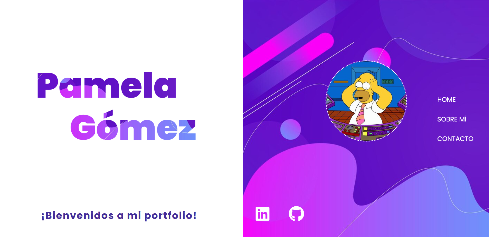
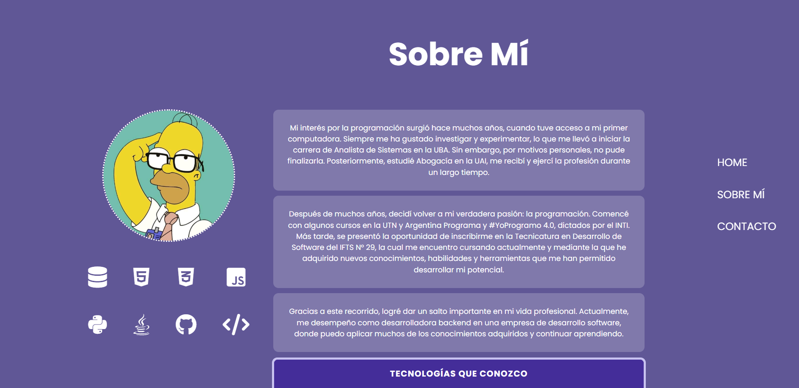
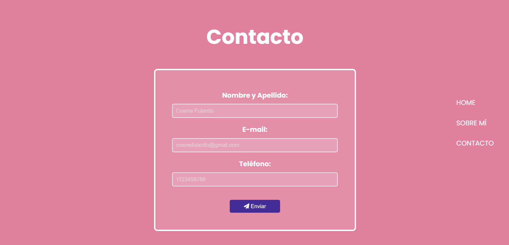

## PRIMERA ENTREGA

Hola Profe! Mi nombre es Pamela Gómez estudiante de la comisión B y le presento mi portfolio, me costó bastante hacerlo porque si bien algo de html conozco
hace muchísimo tiempo no lo ponía en práctica, pero le puse mucha onda y me gustaría poder seguir mejorándolo para que quede bien terminado.

Es aun un "work in progress", pero creo que cumple las consignas del trabajo.

El código está hecho de la siguiente manera:
- **index.html:** Tiene el contenido principal. Está dividido en 3 secciones: 
1. Home
2. Habilidaes
3. Contacto

    Cada una tiene lo solicitado en las consignas (imágenes, tablas, formularios, listas, etc) y agregué una barra de navegación a la derecha que nos ayuda a recorrer las distintas secciones.
- **css:** esta carpeta contiene el archivo styless.css que tiene los estilos de todo el index.
images: esta carpeta contiene los archivos de imagen de toda la página.

Espero que le guste!

Saludos. :D

## SEGUNDA ENTREGA

Hola Profe! Primero que nada me disculpo por demorar tanto en entregar.  La parte del responsive me llevó mucho más tiempo del que me hubiera gustado.

Trabajé mucho con la responsividad, tratando de que no se rompa nada al cambiar los tamaños, me demandó muchísimo, pero creo que logré conseguirlo. 

Para esta entrega hice bastantes modificaciones e intenté cumplir con todos los requisitos (aunque un poco me perdí y me dejé llevar mi intuición).

#### MODIFICACIONES:

1. **SECCIÓN HOME:** 
    1. **HTML:** Agregué nuevos contenedores con las clases "social-links" y "avatar-container".
    2. **CSS:** Cambié bastante los estilos, utilicé flex para manejar más facilmente las posiciones de los elementos.  Agregué un efecto hover de "rebote" a los íconos que me pareció muy divertido.

2. **SECCIÓN SOBRE MÍ:**

    1. **HTML:** Esta sección llamada "habilidades" originalmente, fue modificada casi por completo.  Agregué varios contenedores y clases para manipular mejor los elementos.  Agregué una imagen como quería originalmente, y también algunos íconos con tecnologías.  Por otro lado, agregué una descripción un poco más extensa sobre mí y también modifiqué la tabla dejando solo las tecnologías que conozco.

    2. **CSS:** Lo primero que hice fue cambiar el color de fondo, el anterior era muy claro y dificultaba la lectura. También utilicé flex, apliqué un grid para acomodar los íconos y opacidad para el fondo de los párrafos.  A los íconos les puse un efecto hover para darle un poco de vida a la sección y a la tabla, a la que le redondee un poco los bordes para que esté en armonía con los demás elementos del sitio.

3. **SECCIÓN CONTACTO:**

    1. **HTML:** Agregué un contenedor "contacto-container" para manejar mejor el formulario con la responsividad.  También agregué un ícono al botón de "Enviar".

    2. **CSS:** No hice demasiadas modificaciones en los estilos de esta sección.  Originalmente quería agregarle una imagen y probé agregarla, pero no me gustó el resultado, así que decidí dejarla con un estilo minimalista jaja  Utilicé un combinador para los labels del formulario.

4. **RESPONSIVIDAD:**  Los principales cambios que ocurren en el sitio al cambiar su tamaño son:

    1. **Bara de navegación:** Pasa de estar a la derecha en columna, a estar arriba en fila y cambia su efecto hover.
    2. **Iconos sociales en Home:** pasan de estar abajo en fila, a estar al medio en columna.  Y van reduciendo su tamaño en pantallas más chicas.
    3. **Imágenes en las secciones:** Van reduciendo su tamaño para acomodarse a las pantallas más chicas, y la imagen de la sección "Sobre Mí" se oculta a partir del tamaño 480px.
    4. **Iconos de tecnologías en "Sobre Mí":** Pasan de estar en una grilla de 4 columnas, a una grilla de 2 columnas a partir de 1080px y de 1 columna a partir de 480.

Creo que es todo, aunque sigue siendo un "work in progress", debo seguir trabajando para que quede al 100%.

¡Espero que le guste!

El portfolio se encuentra deployado: [Mi Portfolio](https://pamelag85.github.io/mi-portfolio/)

Le dejo una muestra de las secciones:

**HOME:**

**SOBRE MÍ:**

**CONTACTO:**
